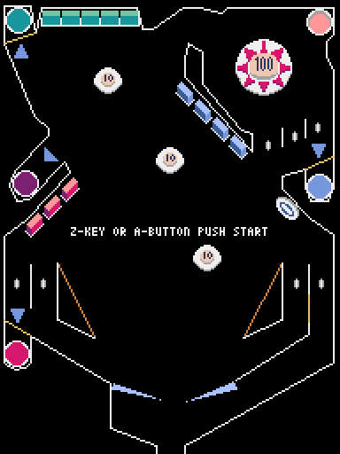
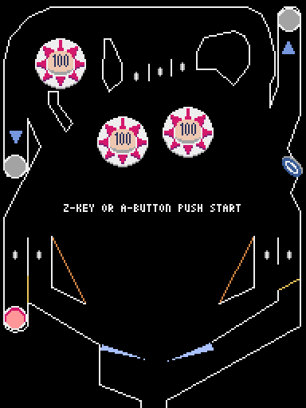
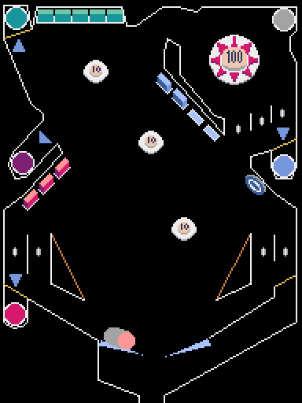

# pymunk_de_pinball
## 注釈
Pyxel version 2.3.0にしたときはWeb版が動作していましたが、1/24現在動作しなくなりました。  
なんらかのバージョンアップがなされたせいなのかもしれません。  
pymunkがロードできないエラーが出ています。  

## 概要
- pymunkライブラリを使ったピンボールシミュレーター。
- ピンボールの仕組みはだいたい入れられたと思う。
- 当たり判定は全てpymunkライブラリの衝突判定を使用しています。
- フリッパー周りの動きは少々怪しいです。「止め」ができない。
- ピンボール台のデザインはピンボールアクションから持ってきてます。
- ピンボール台は全部で４つあります。
- 効果音は、frenchbreadさん作成の「Pyxel RPG SE パック」を使用しています。
  
- ゲーム化してないのでゲームオーバーもなければスコアもありません。
- 将来的にスコアUPの仕組みが入れられたらいいかなと思います、、、が？

## 操作方法
左右ボタン、または、左右キーでフリッパー操作  
Aボタン、または、Zキーでショット  
Bボタン、または、XキーでPyxel Quit  

## スクリーンショット

## GIFアニメ

## 動作確認
- [URL](https://sanbunno-ichi.github.io/pymunk_de_pinball/)

## 更新履歴
2025.01.09 公開
